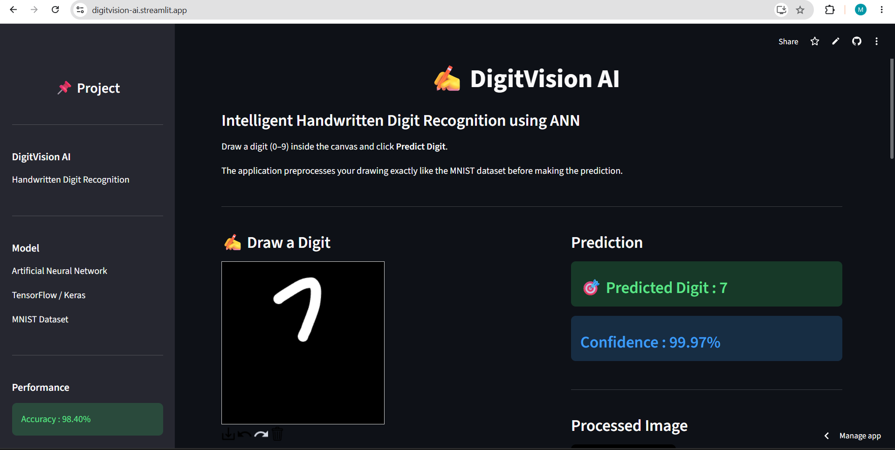

# ✍️ DigitVision AI

### Intelligent Handwritten Digit Recognition using Artificial Neural Networks (ANN)


---

## 📖 Overview

DigitVision AI is an end-to-end Deep Learning project that recognizes handwritten digits using an **Artificial Neural Network (ANN)** trained on the **MNIST Handwritten Digit Dataset**.

The project demonstrates the complete machine learning workflow—from dataset exploration and preprocessing to model development, evaluation, and deployment as an interactive **Streamlit web application**.

Users can draw handwritten digits directly on a digital canvas and receive instant predictions along with confidence scores, processed image visualization, and the top predicted classes. The project combines deep learning with an intuitive user interface, making handwritten digit recognition both interactive and educational.

---

## 🌐 Live Demo

**🚀 Try the deployed application here:**

**https://digitvision-ai.streamlit.app/**

No installation is required. Simply open the link, draw any handwritten digit between **0–9**, and click **Predict Digit** to see the model's prediction in real time.

---

## 🎯 Problem Statement

Handwritten digit recognition is one of the most fundamental image classification problems in Computer Vision and Deep Learning. It serves as the foundation for many real-world applications such as:

- Postal mail sorting
- Bank cheque processing
- Optical Character Recognition (OCR)
- Form digitization
- Educational AI applications

The objective of this project is to build a robust Artificial Neural Network capable of accurately recognizing handwritten digits while providing an interactive interface for real-time inference.

---

## ✨ Key Features

- 🧠 Artificial Neural Network (ANN) for image classification
- 📊 Trained using the MNIST Handwritten Digit Dataset
- 🎨 Interactive Streamlit drawing canvas
- ⚡ Real-time handwritten digit prediction
- 🖼️ Automatic image preprocessing
- 📈 Prediction confidence scores
- 🥇 Top-3 predicted digits
- 🕒 Fast inference with prediction timing
- 📱 Clean, responsive, and interactive user interface
- ☁️ Deployed using Streamlit Community Cloud

---

# 🚀 Project Workflow

The project follows a complete end-to-end Deep Learning workflow, beginning with dataset preparation and ending with deployment as an interactive web application.

```text
                MNIST Handwritten Digit Dataset
                            │
                            ▼
                  Data Loading & Exploration
                            │
                            ▼
                 Image Preprocessing Pipeline
        (Normalization + Flattening to 784 Features)
                            │
                            ▼
            Artificial Neural Network (ANN) Model
                            │
                            ▼
                  Model Training & Validation
                            │
                            ▼
                  Model Evaluation & Testing
                            │
                            ▼
                  Trained ANN Model (.keras)
                            │
                            ▼
               Streamlit Web Application
                            │
                            ▼
      Draw Digit → Predict → Display Results
```

---

# 🏗️ Project Architecture

The project is organized into independent modules for model development, evaluation, deployment, and supporting resources.

```text
DigitVision-AI
│
├── app/                  Streamlit web application
├── checkpoints/          Best model checkpoints
├── figures/              Training graphs & visualizations
├── models/               Saved ANN models (.keras)
├── notebook/             Model development notebook
├── outputs/              Generated outputs & predictions
├── requirements.txt      Project dependencies
└── README.md             Project documentation
```

This modular structure improves maintainability, readability, and future scalability.

---

# 📊 Project Highlights

| Feature | Details |
|----------|---------|
| Project Type | Deep Learning |
| Problem | Handwritten Digit Recognition |
| Model | Artificial Neural Network (ANN) |
| Framework | TensorFlow & Keras |
| Deployment | Streamlit Community Cloud |
| Dataset | MNIST Handwritten Digit Dataset |
| Training Images | 60,000 |
| Testing Images | 10,000 |
| Image Size | 28 × 28 Pixels |
| Number of Classes | 10 |
| Test Accuracy | **98.40%** |
| Programming Language | Python |

---

# 📂 Dataset

The project uses the **MNIST Handwritten Digit Dataset**, one of the most widely used benchmark datasets for handwritten digit recognition and image classification.

The dataset contains grayscale images representing handwritten digits from **0 to 9**, making it an ideal benchmark for evaluating deep learning models.

## Dataset Summary

| Attribute | Value |
|-----------|------:|
| Dataset Name | MNIST |
| Total Images | **70,000** |
| Training Images | **60,000** |
| Testing Images | **10,000** |
| Image Resolution | **28 × 28 Pixels** |
| Color Format | Grayscale |
| Number of Classes | **10** |
| Classification Type | Multi-Class Image Classification |

The dataset is well-balanced across all digit classes, allowing the model to learn representative patterns while reducing class bias during training.

---

# 📊 Exploratory Data Analysis (EDA)

Before training the model, the MNIST dataset was explored to understand its characteristics and verify data quality.

The exploratory analysis included:

- Understanding dataset dimensions
- Visualizing handwritten digit samples
- Inspecting class distribution
- Verifying image dimensions
- Examining pixel intensity values
- Understanding the dataset structure before preprocessing

These steps ensured that the dataset was clean, balanced, and suitable for training a deep learning model.

---

# 🧹 Image Preprocessing

The original MNIST images undergo several preprocessing steps before being used for model training.

### Preprocessing Pipeline

- Load the MNIST handwritten digit dataset
- Normalize pixel values from **0–255** to **0–1**
- Flatten each **28 × 28** image into a **784-dimensional feature vector**
- Prepare labels for multi-class classification
- Split the dataset into training and testing sets

### Processed Dataset Summary

| Dataset | Shape |
|----------|-------|
| Training Images | **(60000, 784)** |
| Testing Images | **(10000, 784)** |
| Training Labels | **(60000, )** |
| Testing Labels | **(10000, )** |
| Input Features | **784** |

The preprocessing pipeline improves model convergence and prepares the dataset for efficient ANN training.

---

# 🧠 Artificial Neural Network (ANN)

DigitVision AI uses a fully connected Artificial Neural Network (ANN) designed for handwritten digit classification.

Each input image is flattened into a one-dimensional feature vector before passing through multiple dense layers that learn increasingly complex handwritten digit representations.

## Model Architecture

| Layer | Configuration |
|--------|---------------|
| Input Layer | 784 Features |
| Hidden Layer 1 | Dense (256 Neurons, ReLU) |
| Dropout | 0.30 |
| Hidden Layer 2 | Dense (128 Neurons, ReLU) |
| Dropout | 0.20 |
| Output Layer | Dense (10 Neurons, Softmax) |

### Model Summary

| Parameter | Value |
|-----------|------:|
| Total Parameters | **235,146** |
| Trainable Parameters | **235,146** |
| Non-Trainable Parameters | **0** |

The Softmax activation function generates probability scores for all ten digit classes, enabling the model to predict the most likely handwritten digit.

---

# ⚙️ Model Training

The model was trained using TensorFlow and Keras with a focus on achieving high accuracy while preventing overfitting.

### Training Configuration

| Parameter | Value |
|-----------|-------|
| Framework | TensorFlow & Keras |
| Optimizer | Adam |
| Loss Function | Sparse Categorical Crossentropy |
| Evaluation Metric | Accuracy |
| Maximum Epochs | 20 |
| Early Stopping | Enabled |
| Model Checkpoint | Enabled |

The best-performing model was automatically saved using Model Checkpoint, while Early Stopping restored the best weights once validation performance stopped improving.

---

# 📈 Model Evaluation

The trained model was evaluated on the unseen MNIST test dataset using standard classification metrics.

Evaluation included:

- Test Accuracy
- Test Loss
- Classification Report
- Precision
- Recall
- F1-Score
- Confusion Matrix

These evaluation metrics provide a comprehensive assessment of the model's generalization performance.

---

# 🏆 Final Results

The trained Artificial Neural Network achieved excellent performance on the MNIST handwritten digit dataset.

## Performance Summary

| Metric | Value |
|---------|------:|
| Test Accuracy | **98.40%** |
| Test Loss | **0.0602** |
| Number of Classes | **10** |
| Training Images | **60,000** |
| Testing Images | **10,000** |

### Classification Performance

- Weighted Precision: **98.40%**
- Weighted Recall: **98.40%**
- Weighted F1-Score: **98.40%**

The trained model demonstrates strong generalization capability and accurately recognizes handwritten digits while maintaining excellent performance on unseen test images.

---

# 📸 Application Preview

The application is deployed using **Streamlit Community Cloud**, allowing users to interact with the trained Artificial Neural Network through a clean and intuitive web interface.

Users can simply:

1. Draw a handwritten digit (0–9)
2. Click **Predict Digit**
3. View the predicted digit
4. Check the confidence score
5. Compare the processed 28×28 image
6. Explore the Top-3 predicted classes

> **Application Preview**

<p align="center">
  
</p>

---

# 🌐 Live Demo

🚀 **Try the deployed application here**

**https://digitvision-ai.streamlit.app/**

The application runs entirely online and does not require any local installation.

---

# 🚀 Installation

Clone the repository

```bash
git clone https://github.com/MansiMuneshwar/DigitVision-AI.git
```

Navigate to the project directory

```bash
cd DigitVision-AI
```

Install the required dependencies

```bash
pip install -r requirements.txt
```

---

# ▶️ Running the Application

Launch the Streamlit application

```bash
streamlit run app/app.py
```

Once the server starts, open the local URL displayed in your terminal (typically **http://localhost:8501**) in your browser.

---

# 📂 Repository Structure

```text
DigitVision-AI
│
├── app/
│   └── app.py
│
├── checkpoints/
│
├── figures/
│
├── models/
│   ├── digitvision_ann.keras
│   └── digitvision_streamlit.keras
│
├── notebook/
│   └── DigitVision_AI.ipynb
│
├── outputs/
│
├── requirements.txt
├── README.md
└── .gitignore
```

---

# 🎯 Application Features

The deployed application provides an interactive environment for testing handwritten digit recognition in real time.

### Features

- ✍️ Interactive drawing canvas
- 🧠 ANN-based handwritten digit prediction
- 📈 Prediction confidence score
- 🖼️ Automatic image preprocessing
- 🥇 Top-3 predicted digits
- 📊 Probability distribution visualization
- ⚡ Fast inference
- 📜 Session prediction history
- 🎨 Clean and responsive Streamlit interface

---

# 📈 Project Results

The project successfully demonstrates an end-to-end Deep Learning workflow for handwritten digit recognition.

### Key Achievements

- ✅ End-to-end ANN implementation
- ✅ Interactive Streamlit deployment
- ✅ Publicly accessible live application
- ✅ Approximately **98.40% Test Accuracy**
- ✅ Automatic image preprocessing
- ✅ Real-time handwritten digit recognition
- ✅ Well-structured and reproducible project

---

# 🔮 Future Enhancements

Potential improvements for future versions include:

- Convolutional Neural Network (CNN) implementation
- CNN vs ANN performance comparison
- Handwritten multi-digit recognition
- Webcam-based digit recognition
- Mobile-friendly interface
- REST API using FastAPI
- Docker containerization
- Cloud model serving
- Explainable AI visualizations (Grad-CAM)

---

---

# 🤝 Contributing

Contributions, suggestions, and feedback are always welcome.

If you would like to improve this project:

1. Fork the repository
2. Create a new feature branch
3. Commit your changes
4. Push the branch
5. Open a Pull Request

Please ensure your code follows good programming practices and includes appropriate documentation.

---

# 👩‍💻 Author

### Mansi Muneshwar

**B.Tech Computer Science Engineering**  
**Indian Institute of Technology (IIT) Jodhpur**

🔗 **GitHub**  
https://github.com/MansiMuneshwar

💼 **LinkedIn**  
https://www.linkedin.com/in/mansi-muneshwar/

🌐 **Live Application**  
https://digitvision-ai.streamlit.app/

---

# 🙏 Acknowledgements

This project would not have been possible without the excellent open-source tools and datasets provided by the community.

Special thanks to:

- TensorFlow & Keras
- Streamlit
- NumPy
- Matplotlib
- Pillow
- MNIST Handwritten Digit Dataset
- The Python Open Source Community

---

# 📜 License

This project is released under the **MIT License**.

You are free to use, modify, and distribute this project for educational and research purposes.

---

# ⭐ Support

If you found this project useful or interesting:

⭐ Star this repository

🍴 Fork the repository

💡 Share your feedback and suggestions

Your support is greatly appreciated!

---

# 📬 Contact

For questions, collaborations, or project discussions, feel free to connect with me through **GitHub** or **LinkedIn**.

---

<div align="center">

## ⭐ Thank you for visiting DigitVision AI ⭐

**If you enjoyed this project, don't forget to leave a ⭐ on GitHub!**

</div>

